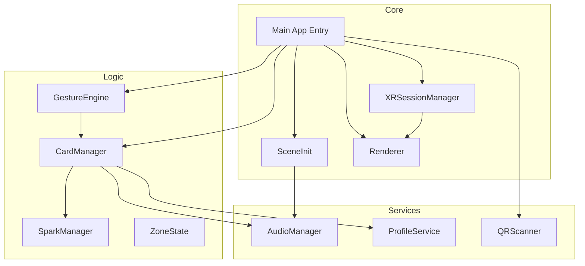

# XR Spark Match Mode - Technical Architecture

## Overview
XR Spark Match Mode is a WebXR-based application designed to facilitate professional networking in mixed reality. It leverages the immersive capabilities of modern browsers to create a "Bumble of XR" experience, where users can discover, match, and connect with other professionals using intuitive gestures and spatial interactions.

## Tech Stack

| Component | Technology | Reasoning |
| :--- | :--- | :--- |
| **Runtime** | **WebXR** | Allows for rapid prototyping and instant access via browser without app store friction. Supports both VR and AR modes. |
| **Framework** | **Three.js** | Standard library for 3D graphics on the web. Provides a robust scene graph and rendering engine. |
| **Build Tool** | **Vite** | Fast development server with HMR (Hot Module Replacement) and optimized production builds. |
| **Language** | **TypeScript** | Ensures type safety and better developer experience for complex logic. |
| **Testing** | **Vitest** | Fast unit testing framework compatible with Vite. |
| **QR Scanning** | **jsQR** | Lightweight library for decoding QR codes from video frames. |

## System Architecture

The application follows a modular architecture, separating core systems (rendering, XR session) from game logic (cards, gestures) and services (profiles, audio).

## Key Components

### 1. CardManager
Manages the lifecycle of profile cards.
- **Spawning**: Creates cards based on profile data.
- **Layout**: Arranges cards in a semi-circle around the user.
- **Interaction**: Handles hover, grab, and selection states.
- **Matching**: Checks proximity between cards to trigger "Spark" effects.

### 2. GestureEngine
Handles user input from XR controllers and hand tracking.
- **Raycasting**: Detects objects pointed at by the user.
- **Swipe Detection**: Analyzes hand velocity to detect swipe gestures.
- **Pinch/Grab**: Manages object manipulation.

### 3. QRScanner
Integrates the device camera to scan physical QR codes.
- **Video Feed**: Captures frames from `getUserMedia`.
- **Decoding**: Uses `jsQR` to extract data.
- **Action**: Triggers profile lookup and card generation upon successful scan.

### 4. AudioManager
Centralized audio management.
- **Loading**: Fetches and decodes audio buffers.
- **Synthesis**: Generates fallback sounds (beeps) if assets are missing.
- **Playback**: Plays sounds for UI events (hover, match, swipe).

## Data Flow

1. **User Enters AR**: `XRSessionManager` requests an `immersive-ar` session.
2. **Scan QR**: User activates `QRScanner`, which detects a code.
3. **Fetch Profile**: `ProfileService` (mock) returns profile data including Domain, Experience, and Location.
4. **Spawn Card**: `CardManager` creates a 3D card entity with `CardUI` texture.
5. **Interact**: User gestures are processed by `GestureEngine`, updating card state (hover/grab).
6. **Feedback**: `AudioManager` plays sounds based on interactions.

## Future Considerations
- **AI Matching**: Integrate an LLM-based backend to analyze profile compatibility in real-time.
- **Multi-user**: Implement WebSockets for real-time shared experiences.
- **Persistence**: Save matches and connections to a local database or cloud storage.
